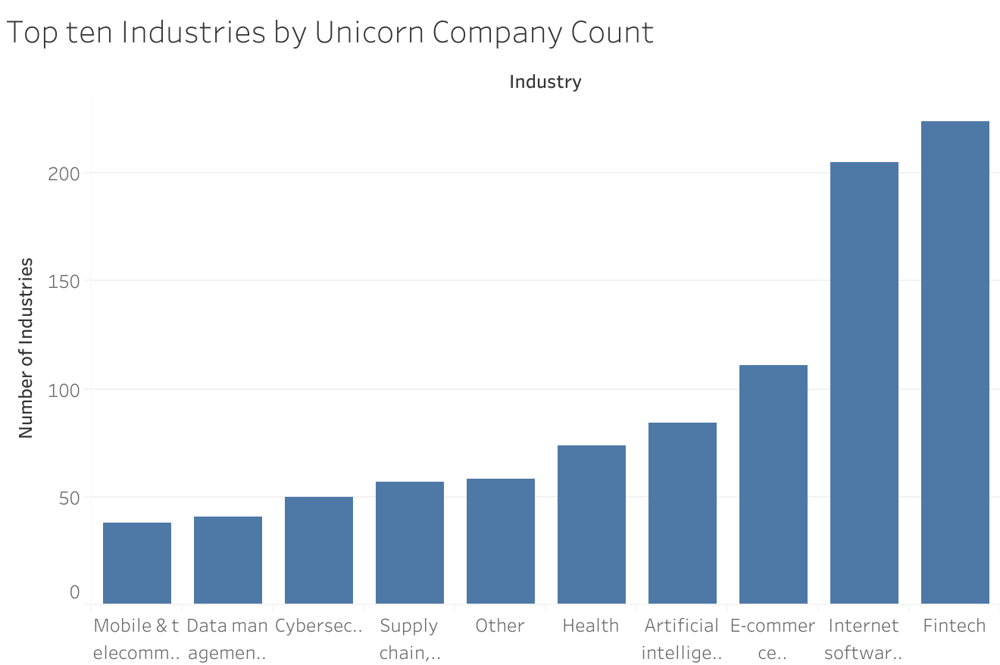
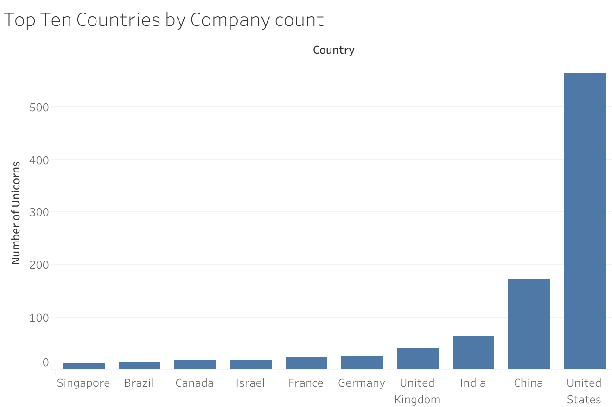
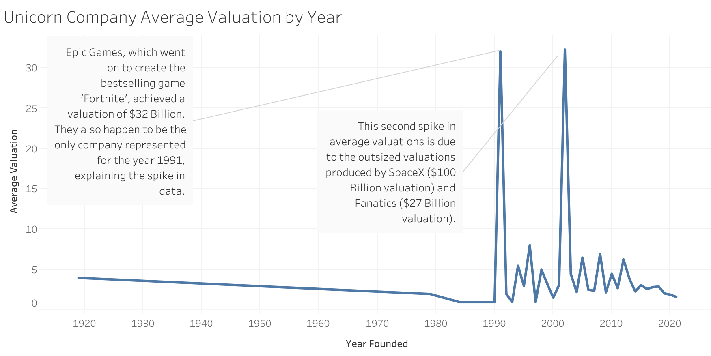
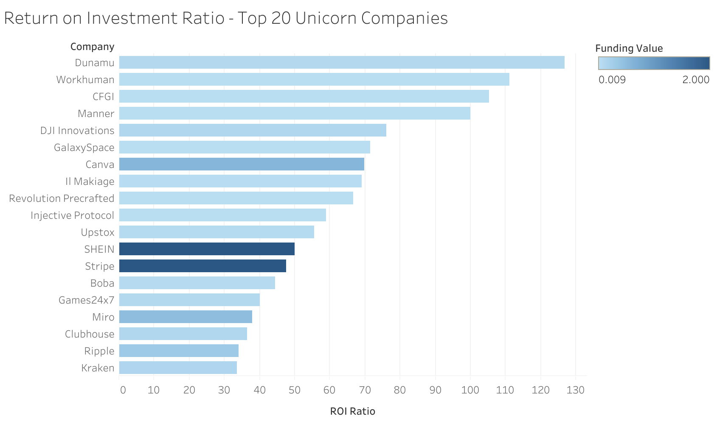
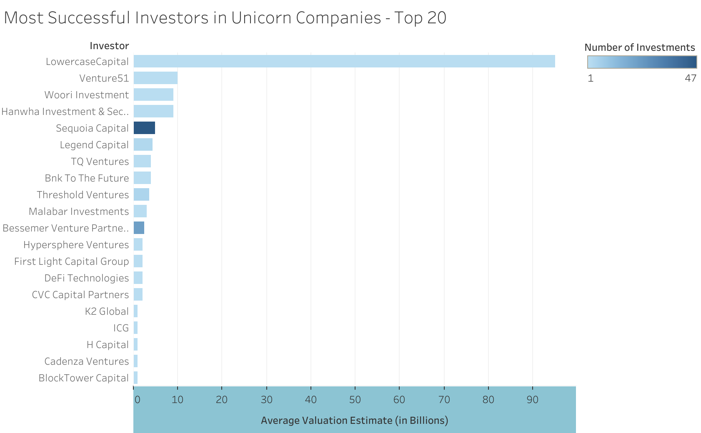

# Unicorn Companies SQL Analysis

Comprehensive SQL analysis on a dataset of global unicorn companies from [Maven Analytics](https://www.mavenanalytics.io/data-playground), with additional data augmentation, cleaning, and transformation performed using Python. The final product includes visualizations and business-driven insights on funding patterns, valuation trends, geographic distributions, and investor performance.

---

## Purpose

This project explores global trends in unicorn company formation by industry, country, city, and investor. By leveraging a real-world dataset of billion-dollar startups, the analysis aims to uncover insights about industry concentration, investor success, geographic hotspots, and return on investment ratios. The goal is to transform raw data into meaningful, business-grade intelligence using MySQL and Tableau, combining technical skill with commercial awareness. This project is ideal for demonstrating data wrangling, SQL logic, and data storytelling capabilities in a modern business analytics context.

---

## Dataset Overview

- `UnicornCompanyData.csv`: Main dataset of unicorn companies
- `company_investors_clean.csv`: Supplementary dataset mapping companies to each individual investor

---

## Tech Stack
- **SQL** (MySQL Workbench)
- **Python** (pandas, SQLAlchemy, pymysql)
- **Tableau Public** (Interactive Visualizations)
- **Jupyter Notebook** (Data Cleaning & Automation)
- **Jekyll/GitHub Pages** (Portfolio Integration)

---

## Key Questions Answered

### 1. Geographic Distribution
- Which countries, cities, and continents produce the most unicorns?

### 2. Industry Saturation
- What industries are most dominant in unicorn production?
- How do unicorn industry leaders compare in terms of company count and valuation?

### 3. Valuation Trends
- What is the average valuation by year?
- Which companies are the most valuable?
- How can we measure ROI (Return on Investment) using valuation and funding data?

### 4. Investor Impact
- Which investors are most active?
- Which are most successful (highest average valuation)?
- Which investors show repeatability or impact across industries?

### 5. Founding Trends
- What is the distribution of unicorn companies by year founded?

---

## Featured Visualizations

### Top Ten Industries by Unicorn Company Count

[Interactive Tableau Link](https://public.tableau.com/app/profile/sebastian.marrero/viz/TopTenIndustriesbyUnicornCompanyCount/Sheet1)

---

### Top Ten Countries by Unicorn Company Count

[Interactive Tableau Link](https://public.tableau.com/app/profile/sebastian.marrero/viz/TopTenCountriesbyUnicornCompanyCount/Sheet1)

---

### Average Valuation by Year

[Interactive Tableau Link](https://public.tableau.com/app/profile/sebastian.marrero/viz/UnicornCompanyAverageValuationbyYear/Sheet1)

---

### Return on Investment Ratio (Top 20 Unicorns)

[Interactive Tableau Link](https://public.tableau.com/app/profile/sebastian.marrero/viz/ReturnonInvestmentRatio-Top20UnicornCompanies/Sheet1)

---

### Most Successful Investors in Unicorn Companies

[Interactive Tableau Link](https://public.tableau.com/app/profile/sebastian.marrero/viz/MostSuccessfulInvestorsinUnicornCompanies-Top20/Sheet2#1)

---

## Insights

### Market Overview
- The United States dominates the unicorn landscape by a wide margin, with China and India following behind.
- San Francisco leads globally for city-based unicorn concentration, highlighting Silicon Valley’s continued importance.
- Internet Software and Fintech are the most prolific industries, accounting for the largest shares of unicorn creation.
- Unicorn formation accelerated significantly after 2010, corresponding with the rise of mobile technology and venture capital expansion.

### Valuation and Funding Trends
- The average unicorn valuation has steadily increased over time, peaking for companies founded between 2010–2015.
- ByteDance, SpaceX, and Stripe are among the most highly valued companies, significantly skewing overall valuation averages.
- While some unicorns have raised enormous funding rounds, high fundraising does not always correlate with highest valuation.
- Certain companies (e.g., Canva, Figma) demonstrated exceptionally high valuation relative to funding raised — signaling strong capital efficiency.

### Investor Activity and Performance
- Sequoia Capital, Accel, and Andreessen Horowitz are among the most active unicorn investors based on company count.
- However, being prolific doesn’t always mean producing top valuations: Some smaller investors show stronger average valuation per company invested in.
- The "Most Impactful Investors" combine both high company count and strong average valuations, with Sequoia and Tiger Global emerging as standouts.
- Investor repeatability is common among top VC firms — with frequent participation in multiple unicorns across different industries.

### Capital Efficiency and ROI Metrics
- Basic ROI calculations (Valuation ÷ Funding Value) show that Canva, Stripe, and Dunamu are among the highest-performing unicorns relative to investment.
- Companies with high ROI scores often belong to SaaS or fintech sectors, reflecting scalable business models with low marginal costs.
- Some companies with extremely high funding (e.g., Uber) show lower ROI ratios due to high burn and operational expenses.

### Industry Evolution and Trends
- Internet Software was the dominant sector for unicorn creation during the early 2010s.
- More recently, sectors like Artificial Intelligence, Blockchain, and HealthTech have gained momentum.
- Fintech remained resilient across all periods, consistently producing unicorns even during market downturns.

---

## How to Reproduce

1. Clone the repository:
```bash
git clone https://github.com/SebastianMarrero/Unicorn_SQL_Project.git
```
2. Open MySQL Workbench and run setup scripts.
3. Use Jupyter Notebook or Python script to preprocess and load CSVs.
4. Explore `.sql` queries and Tableau visualizations.
5. Launch your own custom analysis or dashboard!

---

## Contact

Created by **Sebastian Marrero**

Email: sebastianmarrero64@gmail.com

LinkedIn: [linkedin.com/in/sebastianmarrero](https://linkedin.com/in/sebastianmarrero)
